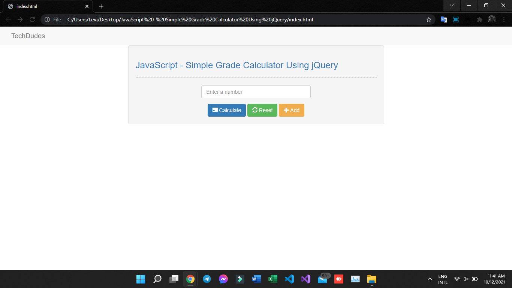

# Simple Grade Calculator Using jQuery

In this tutorial we will create a Simple Grade Calculator using jQuery. JavaScript is a scripting or programming language that allows you to implement complex things on web pages. It is widely used in designing a stunning website. It is an interpreted programming language that has the capabilities of Object-Oriented. This code can be used as your calculator for any mathematical problem.




# So Let's do the coding...
Getting started:
This is the link for the bootstrap that has been used for the layout of the calculator https://getbootstrap.com/.

And this is the link for the jquery that i used in this tutorial https://jquery.com/.

# The Main Interface
This code contains the interface of the application. To create this just write these block of code inside the text editor and save this as index.html.
```HTML
<!DOCTYPE html>
<html lang="en">
 <head>
 <meta charset="UTF-8" name="viewport" content="width=device-width, initial-scale=1"/>
 <link rel="stylesheet" type="text/css" href="css/bootstrap.css"/>
 </head>
<body>
 <nav class="navabar navbar-default">
 <div class="container-fluid">
 <a class="navbar-brand" href="https://web.facebook.com/TechDudes101">TechDudes</a>
 </div>
 </nav>
 <div class="col-md-3"></div>
 <div class="col-md-6 well">
 <h3 class="text-primary">JavaScript - Simple Grade Calculator Using jQuery</h3>
 <hr style="border-top:1px dotted;"/>
 <div class="col-md-3"></div>
 <div class="col-md-6">
 <div class="form-group" id="data">
 <input type="number" placeholder="Enter a number" class="form-control grade" min="0" max="100"/>
 </div>
 <div id="result">
 </div>
 <center><button class="btn btn-primary" id="calculate"><span class="glyphicon glyphicon-credit-card"></span> Calculate</button> <button class="btn btn-success" id="reset"><span class="glyphicon glyphicon-refresh"></span> Reset</button> <button class="btn btn-warning" id="add"><span class="glyphicon glyphicon-plus"></span> Add</button></center>
 </div>
 </div>
<script src="js/jquery-3.2.1.min.js"></script>
<script src="js/script.js"></script>
</body>
</html>
```
# Creating the Script
This code contains the script of the application. This will calculate the average of the given grade. To do this just copy and write these block of codes as shown below inside the text editor and save it as script.js inside the js folder.
```Script
$(document).ready(function(){
 $('#add').on('click', function(){
 var newField = $('<br /><input type="number" placeholder="Enter a number" class="form-control grade" min="0" max="100"/>');
 newField.appendTo($('#data'));
 });
 
 $('#reset').on('click', function(){
 window.location = "index.html";
 });
 
 $('#calculate').on('click', function(){
 var grades = [];
 $('.grade').each(function(){
 if($(this).val() == ""){
 alert("Please complete the required field");
 return false;
 }
 
 grades.push($(this).val());
 });
 
 var sum = eval(grades.join('+')), avg = sum / grades.length;
 if(avg >= 75){
 $('#result').html("<center>You're grade is <label class='text-primary'>"+ avg.toFixed(0) +"</label> <label class='text-success'>You passed!</label></center>");
 }else if(avg < 75){
 $('#result').html("<center>You're grade is <label class='text-primary'>"+ avg.toFixed(0) +"</label> <label class='text-danger'>You failed!</label></center>");
 }
 });
});
```

For more updates and tutorials just kindly visit my Github Account @IamLev1 

FOR YOUR OWN SAFETY, PLEASE:

1. Re-scan downloaded files using your personal virus checker before using it.
2. NEVER, EVER run compiled files (.exe's, .ocx's, .dll's etc.)--only run source code.

# Enjoy Coding!


